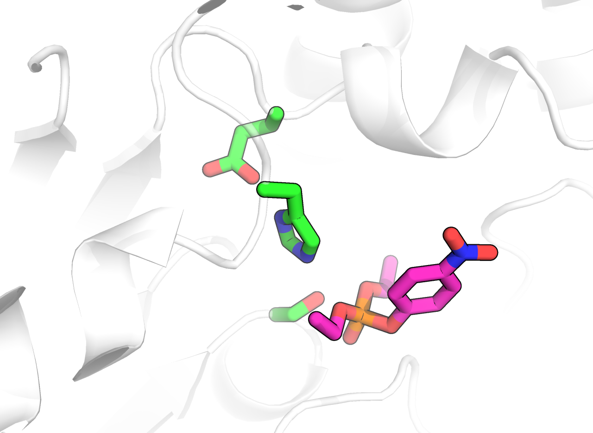
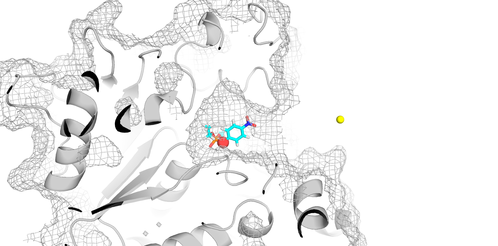
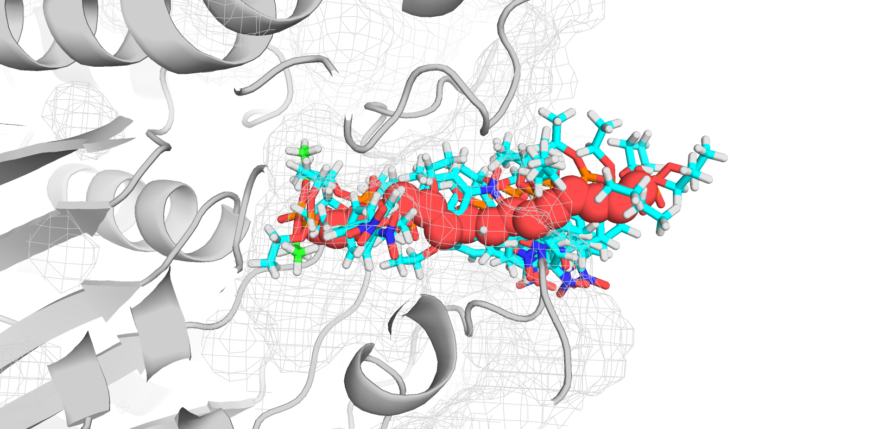
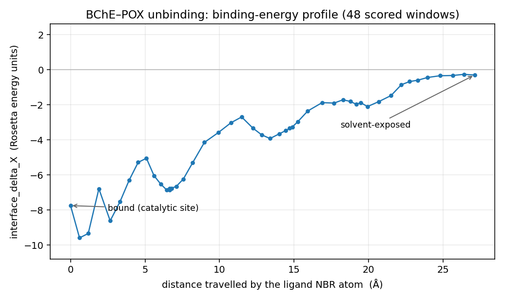
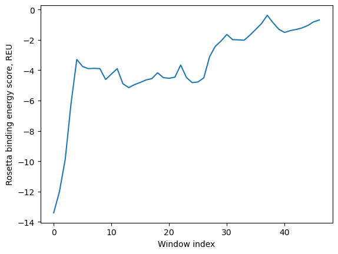

# Ligand PathFinder — Tutorial 1

*Originally written 27 January 2025 by Aleksandr Zlobin. Revised 28 August 2026 for
the current code base (config schema in `docs/config_reference.md`, updated
RosettaScripts XMLs in `rosettaXML_files/`).*

This tutorial walks through a complete Ligand PathFinder (LPF) run — coarse path
finding followed by a trajectory — on one worked example. Every input file used
below is pre-made and shipped in this `demo/` folder:

```
demo/
├── tutorial.md                ← this file
├── figures/                   ← figures referenced in the text
├── coarse_path/               ← stage 2 (see §2)
│   ├── files/                 coarsepath.xml, options, VRT1.params
│   ├── ligand/                lig.params, lig_conformers.pdb
│   ├── path                   two-point guess direction
│   ├── header.pdb             empty (no metal constraints)
│   ├── start.pdb              minimized BChE–POX complex
│   ├── run.json               run configuration
│   └── run/                   where the coarse-path run writes its output
└── trajectory/                ← stage 3 (see §3)
    ├── files/                 main_standard.xml, zero_minimize.xml, stats.xml, options, VRT1.params
    ├── ligand/                lig.params, lig_conformers.pdb
    ├── path                   the coarse path from stage 2 (coarsepath.txt)
    ├── header.pdb             empty
    ├── start.pdb              same minimized complex
    ├── run.json               run configuration
    └── run/                   where the trajectory run writes its output
```

> **The finished runs are not in the repository.** Every input file below is
> tracked, but the `run/` folders are `.gitignore`d — a complete pair of runs is
> ~180 MB of decoy archives and trajectory PDBs. Create the `run/` folders and
> reproduce them as described in §2.2 and §3; the numbers quoted in this
> tutorial come from exactly those commands.
>
> If you would rather read the published results than recompute them, they are
> archived on Zenodo — [`10.5281/zenodo.23183178`](https://doi.org/10.5281/zenodo.23183178). Inside
> `LigPF2026.zip`, `zenodo/demo/coarse_path/run/` and
> `zenodo/demo/trajectory/run/` are exactly the two `run/` folders below.

Please note any parts that could benefit from additional automation and send
feature requests to the developers.

## Requirements

* A Conda environment built from `environment.yml` at the repository root
  (`conda env create -f environment.yml && conda activate ligpf`). The Python
  side only needs `numpy` and `scipy`; `zip` is used when `output.archive` is on.
* A Rosetta `rosetta_scripts` binary — its path goes into the `"rosetta"` key of
  `run.json`. An MPI launcher (e.g. `mpirun`) is only needed if you set
  `rosetta_scripts.n_proc > 1` (and then the binary must be an `.mpi.` build).

## Contents

1. [System preparation](#1-system-preparation)
   * [1.1 Binding pose](#11-binding-pose)
   * [1.2 Rosetta parameters for the ligand](#12-rosetta-parameters-for-the-ligand)
   * [1.3 Starting file for Ligand PathFinder](#13-starting-file-for-ligand-pathfinder)
2. [Coarse path finding](#2-coarse-path-finding)
   * [2.1 Preparation](#21-preparation)
   * [2.2 Run](#22-run)
3. [Trajectory](#3-trajectory)
4. [(Optional) Replicates](#4-optional-replicates)
5. [Adjustments](#5-adjustments)

---

## 1. System preparation

For this tutorial we use **human butyrylcholinesterase
([BChE](https://www.uniprot.org/uniprotkb/P06276/entry))**. It has a deep binding
gorge that is well suited to exploration with Ligand PathFinder. As a ligand we
use [paraoxon](https://pubchem.ncbi.nlm.nih.gov/compound/Paraoxon) (POX), a
covalent inhibitor of the enzyme that uses its catalytic machinery for the first
step of the acylation reaction.

Ligand PathFinder starts from a PDB file of the enzyme–ligand complex in a
functionally relevant conformation / binding pose:

* For enzyme–substrate complexes (a covalent inhibitor can be treated as a
  substrate for a partial reaction) — the pre-reactive state.
* If the question concerns product release — the product placed in the
  immediate after-reaction pose.
* For enzyme–inhibitor complexes — the functional binding pose of the inhibitor.
* For complex cases (multiple substrates, cofactors, binding-triggered
  conformational changes) — understand the sequence of events from fundamental
  studies (what binds first, to which protein conformation, what unbinds first,
  how the conformation changes) and reduce the task to the elementary step.

### 1.1 Binding pose

Constructing the protein–ligand(s) complex is the first prerequisite for Ligand
PathFinder, and it is **not** solved within it. Any docking tool or approach can
be used at this stage: AutoDock Vina, Rosetta, GLIDE, DiffDock,
AF3 / chai-1 / boltz-1 prediction, manual construction. Manual verification of
the adequacy of the result is recommended.

Here we use a chai-1 prediction, since it agrees perfectly with our previous
results:



### 1.2 Rosetta parameters for the ligand

*(This section is unchanged from the original tutorial — the procedure does not
depend on the LPF version.)*

**1.2.1.** First, we need a standalone **sdf** file for the ligand with protons
and correctly specified bond orders. For some docking tools this file already
exists. We can work with the ligand we have from the docking stage, or use it
only as guidance and create a standalone protonated file independently.

If we work with a chai-generated cif file:

* We can protonate in PyMOL, then double-check protonation and bond orders and
  correct them in the builder tool.
* We can use PyMOL to save only the ligand in a standalone file and use Avogadro
  to manually add protons and correct bond orders.
* Or use any proton-adding tool on this file (SPORES, OpenEye, OpenBabel).

If we create the file anew:

* Build the molecule in Avogadro and then minimize.
* Download the pre-built sdf from a database.
* Use any SMILES-to-sdf converter tool with subsequent energy minimization.

For POX, an sdf file was available on PubChem. It is Kekulized. For the Rosetta
parameter creation steps it is better to specify aromaticity explicitly — i.e.
change bond types from alternating 1, 2 to 4 for the whole aromatic ring. We do
this manually.

**1.2.2.** We need a library of conformers for the ligand in **sdf** format. A
number of tools can be used. The default RosettaLigand way is to use BCL as
described in the tutorials
([here](https://static.igem.org/mediawiki/2020/d/d7/T--Aalto-Helsinki--model_guide.pdf),
step 3.2). Other tools are RDKit, CREST, OpenEye. Here we used BCL:

```
bcl molecule:ConformerGenerator -ensemble_filenames pox.sdf \
    -conformers_single_file pox_conf.sdf -explicit_aromaticity
```

**1.2.3.** We create Rosetta parameters for the ligand in the standardized way:

```
rosetta/main/source/scripts/python/public/molfile_to_params.py \
    -n lig -p lig --conformers-in-one-file pox_conf.sdf
```

We get several crucial files:

* `lig.pdb`
* `lig.params`
* `lig_conformers.pdb`

`lig.params` and `lig_conformers.pdb` are needed directly for Ligand PathFinder
runs. `lig.pdb` is needed to modify the complex PDB file, since we need a
starting PDB with the ligand not only in the correct pose but also with protons
and all atoms **in the correct order**.

**1.2.4.** We create a starting protein–ligand complex PDB that works with the
Rosetta parameter files. One way is PyMOL:

```
set retain_order, 1
```

Then open the protein–ligand docking result and `lig.pdb` alongside. Manually
adjust the position and conformation of `lig` from `lig.pdb` to match the pose
from the previous docking (chai prediction). Finally, output the protein and the
ligand from `lig.pdb` into a new PDB file, **`complex.pdb`**.

> In `demo/*/ligand/` you will find the resulting `lig.params` and
> `lig_conformers.pdb` for POX. The ligand's `NBR_ATOM` (declared in
> `lig.params`) is `O1` — this is the atom LPF tracks along the path. Note that
> LPF now reads the neighbour atom from `lig.params` directly; there is no longer
> a `ligand_nbr` key in `run.json`.

### 1.3 Starting file for Ligand PathFinder

We adjust the atomic model to the Rosetta force field with a relaxation or a
minimization:

```
rosetta/main/source/bin/minimize.static.linuxgccrelease -s complex.pdb \
    -extra_res_fa lig.params -restore_pre_talaris_2013_behavior
```

Manual inspection of the relaxed structure is highly recommended. It is also
recommended to run several attempts (`-nstruct <N>`) and pick the best for the
subsequent LPF run.

> **On generating the starting pose automatically.** LPF now has a `dock_zero`
> option: when it is set, before the main routine starts, the ligand is docked
> onto the first point of the guide path (using `rosetta_scripts.protocol_zero_dock`
> / `nstruct_zero`). This is useful when the starting structure contains the
> ligand but not yet in position. **We still strongly recommend preparing and
> validating the binding pose separately** — it is far too important a step to
> delegate to any algorithm alone. In this tutorial we keep `dock_zero: false`
> and provide a hand-prepared, minimized `start.pdb`. When `dock_zero` is off,
> window 0 of the trajectory is still passed through `protocol_zero`
> (`zero_minimize.xml`), which only settles the supplied pose into the force
> field.

*Optional:* relaxation of an enzyme–substrate complex in Rosetta is a fine and
peaky process. It may not be solved automatically for a particular system. One
option is to first relax the protein without the ligand, then superpose it back,
transfer the ligand, and repeat the relaxation/minimization. Another is to use
custom relaxation scripts (particularly for metalloenzymes) through the XML
RosettaScripts interface, potentially with a Cartesian score function and
manually curated restraints, to reliably model pre-reactive poses.

*Optional:* enzymes sometimes have non-standard protonation patterns and crucial
water molecules. These cases require manual attention. Manually specifying a His
tautomer, Asp/Glu/His protonation state, or neutral termini is currently not
possible in Rosetta; please contact the core developers if your systems require
it.

In the end we copy the selected best configuration as **`start.pdb`**. **It is
crucial that in this file the ligand is placed after the protein** — see
`demo/coarse_path/start.pdb`.

---

## 2. Coarse path finding

The main Ligand PathFinder routine needs a **guess path**. It can be created
manually or with third-party software such as CAVER or AQUA-DUCT. In that case
the path is a series of points in 3D space written line by line in a text file,
starting from the coordinates of the ligand's `NBR_ATOM`:

```
1.104 0.834 0.452
1.054 0.800 0.552
1.000 0.777 0.587
…
0.245 0.345 0.923
```

If you already have such a path, skip to §3 and use it as the trajectory
`path` file.

Ligand PathFinder also has a routine to create guess paths by itself — this is
the **coarse path** stage, and it is what we use here.

### 2.1 Preparation

The folder structure for a coarse-path run (`demo/coarse_path/`):

```
coarse_path/
├── files/
│   ├── VRT1.params
│   ├── coarsepath.xml
│   └── options
├── ligand/
│   ├── lig.params
│   └── lig_conformers.pdb
├── path
├── header.pdb
├── start.pdb
└── run.json
```

**`files/`** holds *general* LPF files that do not depend on the system. The XML
instructions and the `options` file are generic; change them only if you know
exactly what you want to happen differently. In `options`, the packing/scoring
flags are standard RosettaLigand settings (the per-calculation sampling depth is
controlled by `rosetta_scripts.nstruct` in `run.json`, not here).

> **`files/` does not have to be unique per project.** These are the same files
> shipped with the repository in **`rosettaXML_files/`**, `coarsepath.xml`
> included. You can copy them into each run folder (as here), or simply point
> `general_files` and the `rosetta_scripts.*` paths in `run.json` straight at
> `rosettaXML_files/`.

**Non-standard residues.** If your system needs extra parameters for a residue
you built yourself (non-canonical amino acid such as carboxy-lysine, a
non-standard cofactor), place the params file in `files/`, add its name to the
`options` file (`-extra_res_fa`), and add its path to `extra_files` in
`run.json`.

**`ligand/`** holds the system-specific ligand files from §1.2.

**`path`** and **`run.json`** are also system-specific. For the coarse stage,
`path` has exactly two lines. The first point is the location of the ligand's
`NBR_ATOM`; the second roughly defines the direction of unbinding. The endpoint
is jittered internally (`endpoint_jitter`), so repeated coarse-path runs with the
same inputs yield a *collection* of guess paths that can be clustered, with the
medoid taken forward to the trajectory stage.

For our BChE–POX case the two points are (shown as spheres):

```
5.755 -5.775 -3.752
9.156 -25.469 -1.308
```



**`run.json`** holds all run parameters and the paths to run-related files. The
same file structure is used for both the coarse-path and the trajectory scripts;
see [`docs/config_reference.md`](../docs/config_reference.md) for every key.
`demo/coarse_path/run.json`:

```json
{
  "rosetta": "<path_to>/rosetta_scripts.linuxgccrelease",
  "general_files": "../files",
  "extra_files": [],
  "input": {
    "guide_path": "../path",
    "ligand_files": "../ligand",
    "ligand_chain": "X",
    "start_pdb": "../start.pdb",
    "header_pdb": "../header.pdb"
  },
  "parameters": {
    "step": 2.0,
    "conformer_subsampling": false,
    "rmsd_constraint": true,
    "rmsd_constraint_type": "harmonic",
    "rmsd_constraint_sd": 1.5,
    "rmsd_constraint_hydrogens": false,
    "in_plane_dev_constraint": true,
    "ipdc_type": "bounded",
    "plane_constraint_sd": 0.02,
    "plane_constraint_point_extent": 7,
    "angle_constraint": true,
    "angle_constraint_type": "bounded",
    "angle_constraint_bound": 2.25,
    "angle_constraint_sd": 0.50,
    "next_angle_constraint": true,
    "next_angle_constraint_type": "bounded",
    "next_angle_constraint_bound": 1.57,
    "next_angle_constraint_sd": 0.25,
    "memory_mode": false,
    "select_best_by": "total_score",
    "endpoint_jitter": true,
    "endpoint_jitter_radius": 5.0,
    "dock_zero": false
  },
  "rosetta_scripts": {
    "options": "../files/options",
    "protocol": "../files/coarsepath.xml",
    "nstruct": 10,
    "n_proc": 1,
    "mpi_launcher": "mpirun"
  },
  "output": {
    "path": "./",
    "archive": true,
    "verbose": true
  }
}
```

Notes on the schema changes since the original tutorial:

* `input.protocol_xml` / `input.rosetta_options` moved into the new
  `rosetta_scripts` section as `protocol` and `options`; run sizes
  (`nstruct`), MPI settings (`n_proc`, `mpi_launcher`) live there too.
* `input.ligand_nbr` was removed — the neighbour atom is read from `lig.params`.
* `parameters.minimize_zero` was replaced by `parameters.dock_zero` (see §1.3).
* `parameters.smooth` is a trajectory-only setting and is ignored here.
* `ipdc_d0`, `ipdc_sd` and `end_padding` have **no effect** in the coarse stage —
  it recomputes the in-plane tolerance per node and always uses a bounded
  constraint. If you leave them in the config the script prints a warning. The
  full list of keys each stage ignores is in
  [`docs/unused_config_settings.md`](../docs/unused_config_settings.md).
* `next_angle_constraint` keeps the ligand aligned with its two path neighbours;
  the plane constraint (via `plane_constraint_point_extent` /
  `plane_constraint_sd`) now uses the same in-plane virtual triangle as the
  trajectory stage.

It is recommended to leave everything in `parameters` as given here for all
coarse-path runs.

**`header.pdb`.** Used only for metalloenzymes, to define metal-binding
constraints. BChE is metal-free, so we use an empty file
(`touch header.pdb`) — `demo/coarse_path/header.pdb`.

### 2.2 Run

Create a folder for the run, go there, and execute the script:

```
mkdir -p demo/coarse_path/run && cd demo/coarse_path/run
python <path_to_lpf>/lpf/lpf_coarse_path.py ../run.json
```

You start to get messages like:

```
STARTED: point 0
FINISHED: point 0
in 0:00:29.

STARTED: point 1
FINISHED: point 1
in 0:00:31.
```

which means the script is running correctly. (`run/` is not in the repository,
so `mkdir -p` creates it; if you re-run into a folder that already holds a
finished run, pass `--fresh` or clear it first.) The bisection tree subdivides the
segment between the two endpoints until neighbouring points are closer than
`step` (2.0 Å here), so the number of points depends on the path length. For this
case it produced 15 nodes (17 points including the two endpoints) in a few
minutes with `nstruct: 10` on one core.

When it finishes you get:

* **`coarsepath.txt`** — xyz coordinates of the guess path. This is the input
  `path` for the next step (trajectory).
* `full_trajectory.pdb` — protein + ligand along the coarse path.
* `lig_trajectory.pdb` — ligand only.
* `trajectory.pdb` — the guess path as PDB points.

For the coarse stage the ligand/protein trajectories are not very useful on their
own — the purpose here is only to produce a guess path. They are handy for
debugging. Everything lands in `demo/coarse_path/run/`; the individual node
directories are zipped (`archive: true`).



---

## 3. Trajectory

Create the same folder structure as for the coarse path (`demo/trajectory/`).
You can reuse `files/` and `ligand/`. The **`path`** file is now the *full* guess
path, so we copy `coarsepath.txt` from §2 into `demo/trajectory/path`.

The trajectory needs a few extra generic XMLs in `files/`:

* `main_standard.xml` — the per-window protocol (was `protocol.xml`).
* `zero_minimize.xml` — window-0 protocol (`protocol_zero`); settles the start
  pose into the force field.
* `stats.xml` — optional second scoring pass (`protocol_stats`), only used if
  `run_stats: true`.

Adjust `run.json` for the trajectory regime — `demo/trajectory/run.json`
(only the parts that differ from §2.1 are highlighted in the comments):

```json
{
  "rosetta": "<path_to>/rosetta_scripts.linuxgccrelease",
  "general_files": "../files",
  "extra_files": [],
  "input": {
    "guide_path": "../path",
    "ligand_files": "../ligand",
    "ligand_chain": "X",
    "start_pdb": "../start.pdb",
    "header_pdb": "../header.pdb"
  },
  "parameters": {
    "step": 0.5,
    "smooth": 0.5,
    "conformer_subsampling": true,
    "conformer_rmsd_threshold": 1.5,
    "rmsd_constraint": true,
    "rmsd_constraint_type": "harmonic",
    "rmsd_constraint_sd": 0.75,
    "rmsd_constraint_hydrogens": true,
    "in_plane_dev_constraint": true,
    "ipdc_type": "bounded",
    "ipdc_d0": 3.0,
    "ipdc_sd": 0.5,
    "end_padding": 5,
    "plane_constraint_sd": 0.02,
    "plane_constraint_point_extent": 5,
    "angle_constraint": true,
    "angle_constraint_type": "bounded",
    "angle_constraint_bound": 2.00,
    "angle_constraint_sd": 0.50,
    "next_angle_constraint": true,
    "next_angle_constraint_type": "bounded",
    "next_angle_constraint_bound": 1.57,
    "next_angle_constraint_sd": 0.25,
    "memory_mode": true,
    "run_stats": false,
    "select_best_by": "total_score",
    "select_next_by": "total_score",
    "noise": false,
    "outlier_rmsd": 2.0,
    "skip": true,
    "dock_zero": false
  },
  "rosetta_scripts": {
    "options": "../files/options",
    "protocol_zero": "../files/zero_minimize.xml",
    "protocol_main": "../files/main_standard.xml",
    "protocol_stats": "../files/stats.xml",
    "nstruct_main": 10,
    "nstruct_stats": 10,
    "n_proc": 1,
    "mpi_launcher": "mpirun"
  },
  "output": {
    "path": "./",
    "archive": true,
    "verbose": true,
    "checkpoint_interval": 10
  }
}
```

What changes relative to the coarse stage:

* `step` is small (0.5 Å) — this is the real, dense trajectory.
* `smooth` is now active: the guess path is fitted with a smoothing spline
  (larger = smoother) and resampled at `step` spacing. The script prints the
  maximum turning angle and what `2×` / `5×` smoothing would give.
* `conformer_subsampling` is on, so before each window the conformer library is
  filtered to conformers within `conformer_rmsd_threshold` of the current pose.
* `memory_mode: true` — the full relaxed pose (including protein motion) is
  carried to the next window, so induced-fit changes accumulate along the path.
* `ipdc_d0` / `ipdc_sd` / `end_padding` **are** honoured here (unlike the coarse
  stage). `end_padding` relaxes the in-plane constraint over the last few
  windows so the ligand can settle into bulk solvent.
* `skip: true` skips windows where the guide path folds back on itself.
* `run_stats: false` here to keep the run short; set it to `true` (with
  `stats.xml`) for a second, independent binding-energy estimate per window.
* `checkpoint_interval: 10` writes a resumable checkpoint every 10 windows; rerun
  the same command to resume, or add `--fresh` to start over.

Create a working folder, go there, and execute:

```
mkdir -p demo/trajectory/run && cd demo/trajectory/run
python <path_to_lpf>/lpf/lpf_trajectory.py ../run.json
```

At start-up the script reports the guide-path curvature and suggests smoother
alternatives — for this case:

```
Guide path curvature: max turn = 47.3° (smooth=0.5)
  informational: 2x smooth (1.0) → 29.2°,  5x smooth (2.5) → 15.2°
  WARNING: 1 step(s) exceed 25°; the angle constraint may not enforce direction at these points:
    gp[25]: 47.3°
```

A sharp kink like this is where the ligand may struggle to follow the guide; if a
run stalls or the ligand cuts the corner, raise `smooth` or run more coarse-path
replicates and pick a straighter medoid.

Progress messages look like:

```
STARTED:  window 1/49
  cst:  angle=0.00  pair=1.19  dihedral=0.00  total=1.19
FINISHED: window 1/49
in 0:00:37.
d_to_plane 0.000
d_in_plane 0.245
```

`d_to_plane` / `d_in_plane` are how far the ligand's `NBR_ATOM` ended up from the
guide plane and from the guide point — small values mean the constraints are
holding. Window 0 is the fast `zero_minimize.xml` pass; the main windows here
take ~30–40 s each with `nstruct_main: 10` on one core (~30 min for the whole
path). Windows where the guide path folds back on itself are skipped (`skip: true`):

```
SKIPPED:  window 37/49  (guide path turns back; plane angle = 167.1°)
SKIPPED:  window 38/49  (guide path turns back; plane angle = 173.5°)
```

For this case the spline gave 50 windows (0–49); 2 were skipped, leaving 48
scored windows. Finished windows are zipped to save space. The main analysis
files (`demo/trajectory/run/`):

* **`interface_scores.txt`** — Rosetta binding-energy estimate
  (`interface_delta_X`) for each scored window. **Main file for analysis.**
* `full_trajectory.pdb` — unbinding trajectory, protein + ligand.
* `lig_trajectory.pdb` — ligand only.
* `total_scores.txt` — total complex energy per window (mostly for debug).
* `nbr_trajectory.txt` — `NBR_ATOM` xyz per scored window (debug).
* `guide_path`, `spline`, `input_path`, `normals` — path construction
  intermediates (debug).
* `stats.pkl` — per-window stats scores; populated only when `run_stats: true`.
* `checkpoint.pkl` — resume state (`checkpoint_interval`).

Plot the binding energy along the path with matplotlib, and inspect the
per-window configurations in PyMOL. The profile below was made from this demo's
own `demo/trajectory/run/` output — `interface_scores.txt` against the cumulative
distance travelled by the ligand `NBR_ATOM` (from `nbr_trajectory.txt`):





The bound state at the catalytic site is favourable (≈ −8 REU); the score climbs
to ≈ 0 as POX leaves the ~27 Å gorge, i.e. this path releases on the order of
~7 REU of interface energy, with shallow local minima where the ligand pauses
against gorge-wall residues. A single replicate is noisy — for quantitative work,
pool `interface_scores.txt` over many replicates (§4).

> **Reproducing this.** The figures and numbers above are the actual output of
> the two `run.json` files as given, against the current code (`nstruct 10`, one
> core: coarse ~5 min, trajectory ~35 min). The runs themselves are not shipped —
> reproduce them with the commands in §2.2 and §3, or take them from
> `zenodo/demo/` in the Zenodo archive
> ([`10.5281/zenodo.23183178`](https://doi.org/10.5281/zenodo.23183178)), then regenerate the figure with a
> two-line script (`np.loadtxt('interface_scores.txt')`). Both stages are
> stochastic, so expect small differences from the profile shown.

---

## 4. (Optional) Replicates

This is a workflow note rather than part of the tutorial. Keeping one folder per
run, with the paths in `run.json` pointing one level up, makes it easy to sample
on a cluster through an sbatch array.

A minimal sbatch script (`run.bash`):

```bash
#!/bin/bash
#SBATCH -n 1
#SBATCH --cpus-per-task=1
#SBATCH --mem=5G
#SBATCH -t 720
#SBATCH -p paul,polaris
RUN_SCRIPT='<path_to>/python <path_to>/lpf/lpf_trajectory.py'
RUNDIR=repl-$SLURM_ARRAY_TASK_ID
mkdir $RUNDIR
cp run.json $RUNDIR
cd $RUNDIR
$RUN_SCRIPT run.json
```

Request as many replicas as you want:

```
sbatch -J task_name -a 0-29 run.bash
```

`0-29` is the task range; each value is passed in as `$SLURM_ARRAY_TASK_ID`. This
runs 30 independent replicas, each creating its own `repl-*` folder. Pool the
per-window `interface_scores.txt` across replicas for a converged profile.

---

## 5. Adjustments

Running a single replica to completion first helps inform the set-up. Analysing
the trajectory, you may notice:

1. **The ligand is too stiff — it moves mostly as a rigid body, not enough
   conformer sampling.**
   1. Check your conformer file: does it have enough distinct conformations? Are
      strained-but-protein-stabilized conformations present? Did you filter by
      energy or cluster by RMSD?
   2. Increase `conformer_rmsd_threshold`.
   3. Increase `rmsd_constraint_sd`.
   4. Consider turning off `rmsd_constraint_hydrogens`.
   5. Decrease `angle_constraint_bound`.
2. **The ligand changes conformation too sharply between steps.**
   1. Apply the suggestions from point 1 in reverse.
   2. Decrease `step`.
3. **The protein is not flexible enough.**
   1. Check that `memory_mode` is `true`.
   2. In `main_standard.xml`, increase `Calpha_restraints`.
   3. In `main_standard.xml`, increase the `LigandArea` cutoffs.
4. **The protein assumes weird conformations.**
   1. Apply the suggestions from point 3 in reverse.
